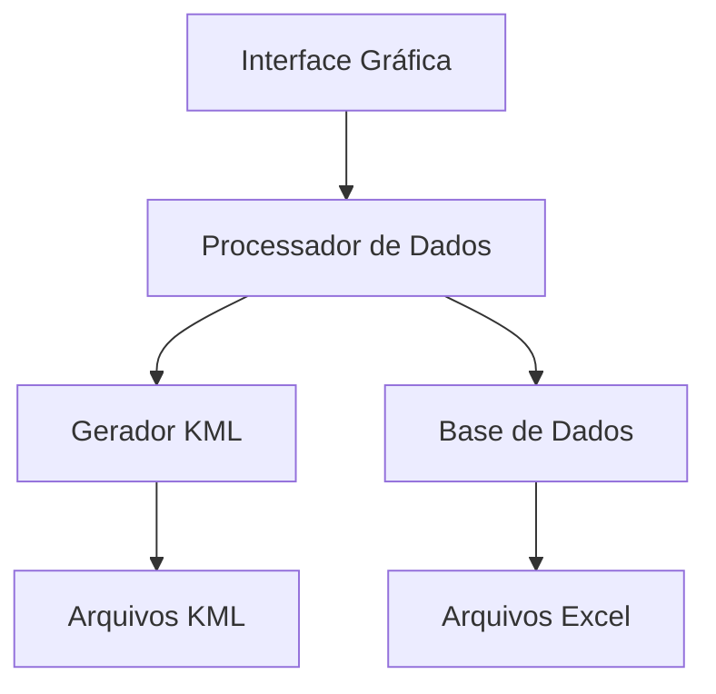

# 📚 Documentação Técnica - KML Itaiquara

## 📋 Índice

1. [Arquitetura](#-arquitetura)
2. [Módulos](#-módulos)
3. [Fluxo de Dados](#-fluxo-de-dados)
4. [API de Classes](#-api-de-classes)
5. [Configuração](#-configuração)
6. [Processamento de Dados](#-processamento-de-dados)
7. [Geração de KML](#-geração-de-kml)
8. [Interface Gráfica](#-interface-gráfica)
9. [Utilitários](#-utilitários)
10. [Testes](#-testes)

## 🏗️ Arquitetura

O projeto segue uma arquitetura modular com os seguintes componentes principais:



### Componentes Principais
- **Interface Gráfica**: Desenvolvida com Flet
- **Processador de Dados**: Manipulação de DataFrames com Pandas
- **Gerador KML**: Criação de arquivos KML com SimpleKML
- **Base de Dados**: Arquivos Excel e KML base

## 📦 Módulos

### 1. Interface (`interface.py`)
- Gerencia a interface gráfica do aplicativo
- Implementa controles e eventos da UI
- Classes principais:
  - `DataManager`: Gerencia dados e operações
  - `KMLApp`: Aplicativo principal

### 2. Processador de Dados (`data_processor.py`)
- Processa e unifica dados de diferentes fontes
- Funções principais:
  - `processar_dados_kml()`: Processa dados dos municípios
  - `processar_cidades_ale()`: Processa dados das cidades
  - `unificar_bases()`: Unifica diferentes bases de dados

### 3. Gerador KML (`kml_generator.py`)
- Gera arquivos KML com diferentes organizações
- Funções principais:
  - `gerar_kml_por_tipo_unidade()`: KMLs separados por tipo
  - `gerar_kml_unificado()`: KML único com todos os dados
  - `gerar_cor_unica()`: Gera cores para identificação visual

### 4. Configuração (`config.py`)
- Configurações globais e constantes
- Definição de diretórios e parâmetros

### 5. Utilitários (`utils.py`)
- Funções auxiliares e ferramentas comuns
- Formatação de valores e textos

## 🔄 Fluxo de Dados

1. **Entrada de Dados**
   ```mermaid
   graph LR
       A[BRUNO.xlsx] --> B[Processador]
       C[KML Base] --> B
       B --> D[DataFrame Unificado]
   ```

2. **Processamento**
   ```mermaid
   graph LR
       A[DataFrame] --> B[Limpeza]
       B --> C[Normalização]
       C --> D[Unificação]
       D --> E[DataFrame Final]
   ```

3. **Geração KML**
   ```mermaid
   graph LR
       A[DataFrame] --> B[Separação por Tipo]
       B --> C[Geração KML]
       C --> D[Arquivos KML]
   ```

## 🔌 API de Classes

### DataManager
```python
class DataManager:
    """Gerencia operações de dados"""
    
    def __init__(self):
        """Inicializa o gerenciador"""
        
    def process_data(self):
        """Processa dados principais"""
        
    def generate_kmls(self):
        """Gera arquivos KML"""
```

### KMLGenerator
```python
class KMLGenerator:
    """Gera arquivos KML"""
    
    def generate_by_type(self, data):
        """Gera KML por tipo de unidade"""
        
    def generate_unified(self, data):
        """Gera KML unificado"""
```

## ⚙️ Configuração

### Variáveis de Ambiente
```env
DEBUG=True
LOG_LEVEL=INFO
DATA_DIR=./data
KML_DIR=./kml-brasil
```

### Configurações do Processamento
```python
PROCESSING_CONFIG = {
    'chunk_size': 1000,
    'max_threads': 4,
    'timeout': 300
}
```

## 📊 Processamento de Dados

### Estrutura do DataFrame Final
| Coluna | Tipo | Descrição |
|--------|------|-----------|
| municipio | str | Nome do município |
| uf | str | Sigla do estado |
| tipo_unidade | str | Tipo da unidade |
| razao_social | str | Razão social |
| coordenadas | str | Coordenadas KML |

### Pipeline de Processamento
1. Carregamento de dados brutos
2. Limpeza e normalização
3. Geocodificação
4. Unificação de bases
5. Validação final

## 🗺️ Geração de KML

### Estrutura dos Arquivos
```xml
<Folder>
    <name>Tipo Unidade</name>
    <Folder>
        <name>Unidade</name>
        <Folder>
            <name>Razão Social</name>
            <Placemark>
                <name>Município</name>
                <!-- Dados e estilo -->
            </Placemark>
        </Folder>
    </Folder>
</Folder>
```

### Estilos e Formatação
```python
STYLE_CONFIG = {
    'polygon_opacity': 0.2,
    'line_width': 2,
    'balloon_style': 'modern'
}
```

## 🖥️ Interface Gráfica

### Componentes Principais
- Barra de progresso
- Seletor de arquivos
- Botões de ação
- Visualizador de log

### Eventos e Callbacks
```python
def on_file_selected(e):
    """Manipula seleção de arquivo"""
    
def on_generate_click(e):
    """Inicia geração de KML"""
    
def on_progress_update(value):
    """Atualiza barra de progresso"""
```

## 🛠️ Utilitários

### Funções de Formatação
```python
def format_value(value, type='text'):
    """Formata valores para exibição"""
    
def normalize_text(text):
    """Normaliza texto removendo acentos"""
```

### Funções de Validação
```python
def validate_coordinates(coords):
    """Valida coordenadas KML"""
    
def validate_municipality(name):
    """Valida nome do município"""
```

## 🧪 Testes

### Estrutura de Testes
```
tests/
├── test_data_processor.py
├── test_kml_generator.py
└── test_utils.py
```

### Exemplos de Testes
```python
def test_data_processing():
    """Testa processamento de dados"""
    
def test_kml_generation():
    """Testa geração de KML"""
```

## 📈 Performance

### Otimizações
- Processamento em chunks
- Caching de dados
- Geração paralela de KML

### Métricas
- Tempo médio de processamento: ~2min
- Uso de memória: ~500MB
- Tamanho médio KML: 2-10MB

## 🔒 Segurança

### Boas Práticas
- Validação de entrada
- Sanitização de dados
- Tratamento de erros

### Tratamento de Erros
```python
try:
    process_data()
except DataError as e:
    log.error(f"Erro no processamento: {e}")
except KMLError as e:
    log.error(f"Erro na geração KML: {e}")
```

## 📚 Referências

- [Documentação Flet](https://flet.dev/docs/)
- [Pandas Documentation](https://pandas.pydata.org/docs/)
- [SimpleKML Documentation](https://simplekml.readthedocs.io/)
- [Google Earth KML Reference](https://developers.google.com/kml/documentation/)
